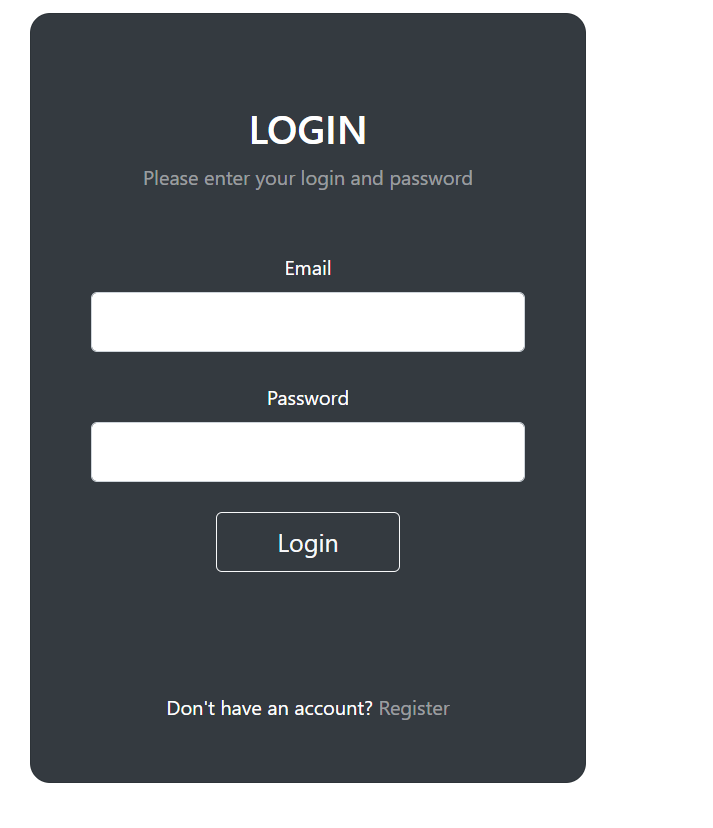

# AI-Hospital
<h2>Help of this project You can search specialty wise doctor  , test chest x-ray of pneumonia ,test blood report and talk with your AI health Bot that ask 5 to 6 question and giev You medical chart </h2>

<h5>Register</h5>

<h5>Log In</h5>

<h5>Home Page</5>

<h6>Select Doctor</h6>

<h5>Test Chest-Xray</h5>

<h5>Check Blood Report</h5>

<h5>Chat Bot</h5>

